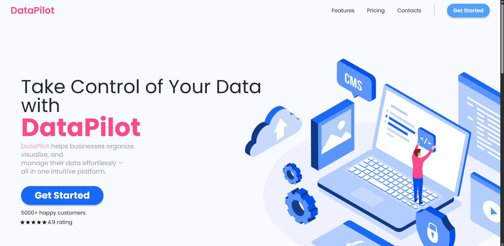

Responsive Landing Page for a fictional SaaS Product called "DataPilot"

modern, fully responsive landing page built for a fictional SaaS product called "DataPilot". This project was created as part of a frontend internship task.

Technologies Used:
    HTML
    Tailwind CSS
    JavaScript

Features:
    Sticky Navbar
    Hero Section
    Features section
    Testimonials Section
    Pricing Section
    CTA section
    Fully responsive

To edit this project you must write the following command in console:
    npm run dev

To view you can just open index.html

Screenshots:
    
    
    